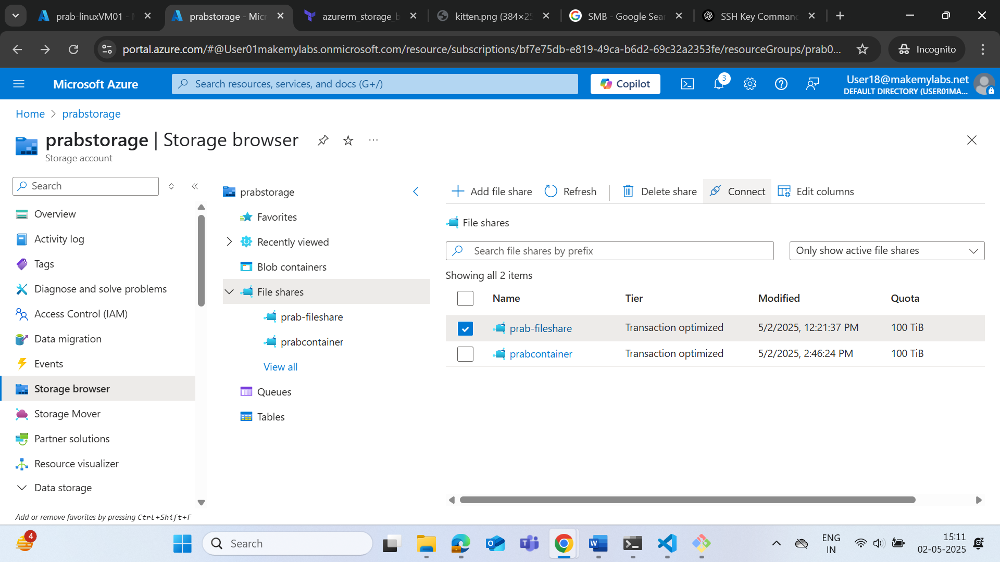
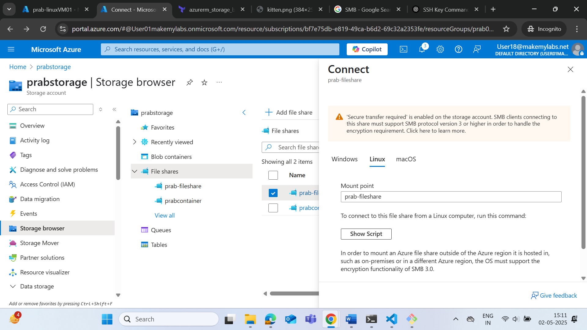
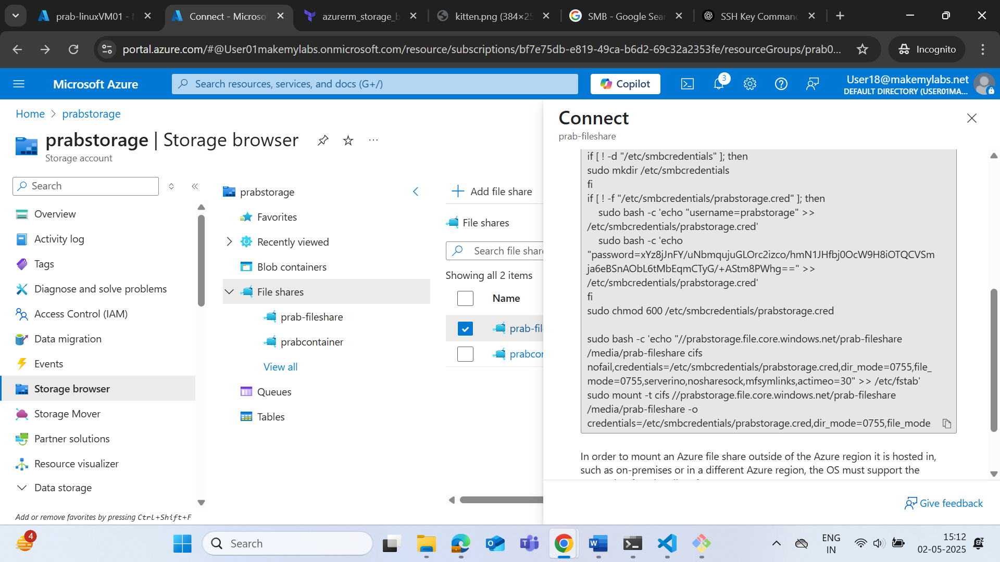
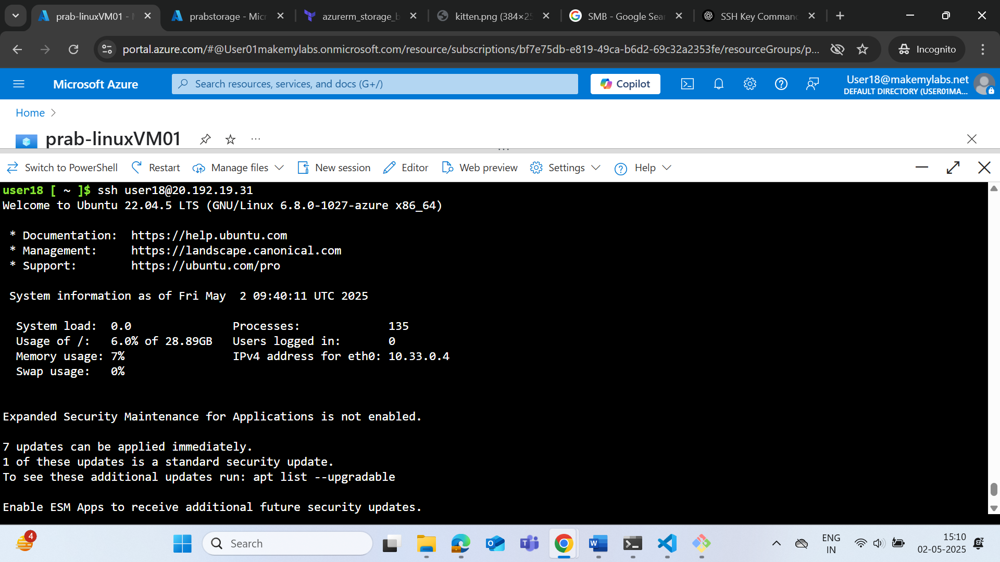
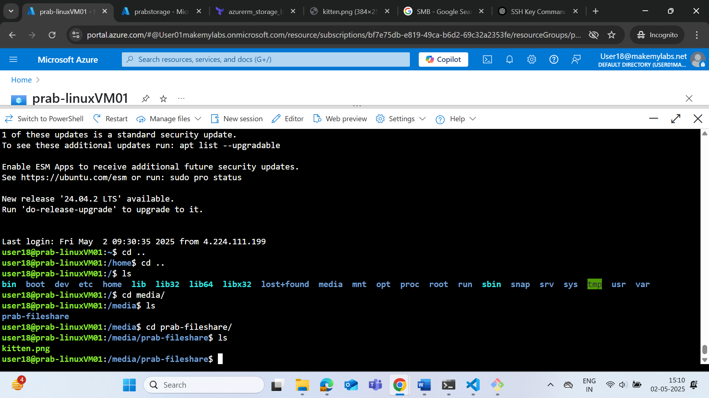

**22-04-2025**


**PaaS** - Referred to platform as a service

## NFR - Non Functional Requirement ## 
- Refer to the characteristics of a software system that are not related to specific functionality or behavior. 
- They describe how the system should perform, rather than what it should do. 

**Example of NFR** 
- Performance 
- Availability and Reliability 
- Security 
- Scalability 
- Maintainability

- **Strategy** is a long term plan while **tactics** is short term plan to achieve a particular goal.

## SaaS - (Software as a Service)##

**Key characteristic**
- Web based access
- Centralized hosting 

**Benefits of SaaS**
- Lower upfront costs
- reduced IT overhead
- faster implementation 
- automatic updates and maintenance 
- scalability and flexibility 
- Accessibility 

## Deployment Model ##
- Public 
- Private 
- Hybrid

**Region**
- An Azure region consists of one or more datacenters, connected by a high-capacity, fault-tolerant, low-latency network connection. 
- Azure datacenters are typically located within a large metropolitan area.

**Availability zones**
- Many Azure regions provide availability zones.
- Availability zones are independent sets of datacenters that contain isolated power, cooling, and network connections.


## What is Azure Virtual Network? ##
- Azure Virtual Network is a service that provides the fundamental building block for your private network in Azure.

**Private IP Addressing:** VNets use private IP addresses for internal communication between resources, helping to ensure security.

**Communication Between Resources:** Resources within the same VNet can communicate with each other using their private IP addresses.

**Subnetting:** A VNet can be divided into multiple subnets to isolate different resources or to implement different levels of security.

**Peering:** VNets can be connected to other VNets within the same region or across regions using VNet Peering.

**VPN Gateways:** You can connect your VNet to on-premises networks through a VPN gateway or an ExpressRoute connection for hybrid cloud scenarios.

**Bastion host**
- A bastion host (also known as a jump host or jump server) is a special-purpose server used to provide secure access to private networks or internal infrastructure (like servers, databases, or internal web apps) from an external network (like the public internet). 
- It acts as a gatekeeper, allowing administrators or users to connect to internal systems without exposing those systems directly to the outside world.

**What Is a Bastion Host?**

- It's the only point of entry into a secured environment.

- All traffic to internal servers must pass through the bastion.

- It's placed in a public subnet (accessible via SSH or RDP), while the internal resources remain in a private subnet (not directly accessible from the internet).

**Scale set**
- In Azure, a scale set is a service that allows you to deploy and manage a group of identical, load-balanced virtual machines (VMs). 
- Scale sets enable you to automatically increase or decrease the number of VMs in response to demand or a defined schedule, providing high availability and scalability for your applications.

**Steps to connect to Azure VM**

1) Open the azure Cloud shell 

2) Change the permission of file to read-only using 
``` bash
chmod 400 key.pem
```


3) command to connect 
``` bash
ssh -i key.pem azureuser@<public_ip>

ssh -i prabhakar-vm01_key.pem azureuser@4.247.27.62
```

---

**23-04-2025**

# VNet and Subnetting Overview

## VNet Scope
- **Vnets are region scoped.**


## Subnetting

For example, let's consider the network `10.0.0.0/24`:

- **IP Range:** `10.0.0.0` to `10.0.0.255`

### Subnet Breakdown:

| N/W     | 1    | 2    | 4    | 8    | 16   | 32   | 64   | 128  | 256  |
|---------|------|------|------|------|------|------|------|------|------|
| HOST    | 256  | 128  | 64   | 32   | 16   | 8    | 4    | 2    | 1    |
| Subnet Mask | /24  | /25  | /26  | /27  | /28  | /29  | /30  | /31  | /32  |

**Calculation:**

- Total range: `32 - 24 = 8`  
- `2^8 = 256` total addresses.

### Subnetting Breakdown:

|           | IP Range      | Network ID  | Broadcast ID | Range      |
|--------------------|----------------|---------------|----------------| --------------|
| **First Range**     | `10.0.0.1 - 10.0.0.62` | `10.0.0.0`    | `10.0.0.63`    | `10.0.0.0/26`  |
| **Second Range**    | `10.0.0.65 - 10.0.0.126` | `10.0.0.64`   | `10.0.0.127`   | `10.0.0.64/26` |
| **Third Range**     | `10.0.0.129 - 10.0.0.190` | `10.0.0.128`  | `10.0.0.191`   | `10.0.0.128/26`|

---

**24-04-2025**

# Azure Essentials and Cloud Concepts


## Creating a New User in Azure

- Go to **Microsoft Entra ID** -> **Manage** -> **Users** -> **Create new User**


## Assigning Azure Role to a User or Group

Assign a predefined Azure role (like Owner, Contributor, Reader, etc.) to a user or group, giving them specific permissions to manage or access resources within the selected subscription.

- Go to: **Subscription** -> **MML** -> **Access Control (IAM)** -> **Add Role Assignment**


## Changing Quota

- **Quota** -> **Settings** -> **My Quota**  
- Click on resources for which we need to increase the quota -> **New Quota Request** -> **Enter a new limit** -> **Submit**

## Benefits of Public Cloud

- Cost efficiency  
- Scalability and flexibility  
- Global reach  
- Focus on core business  
- Sustainability

## Challenges of Public Cloud

- Security concerns  
- Vendor lock-in  

## Azure Global Infrastructure

- Availability Zones  
- Data Centers  
- Region Pairs  
- Azure Global Network

## Edge Location

In Microsoft Azure, an **Edge location** is a physical datacentre that's used to bring Azure services closer to end users for low latency and high performance.

## POP (Point of Presence)

**Point of Presence (POP)** is a network access point that allows data to enter or leave Azure's global network.

## Key Aspects of Cloud Regions

- Geographical Location  
- Multiple Data centers  
- Isolation

## ICMP - Internet Control Message Protocol

ICMP (Internet Control Message Protocol) does not use ports like TCP or UDP.  
Instead, ICMP is a protocol used for sending control messages in a network, such as error messages, echo requests (used in ping), and echo replies.


``` bash
az vm create \
 --resource-group <resource_group_name> \
 --name <vm_name> \
 --location <location> \
 --image <vm_image> \
 --vnet-name <vnet_name> \
 --subnet <subnet_name> \
 --admin-username <admin_username> \
 --admin-password <admin_password>
 ```
---

**25-04-2025**

**Tenants-** the highest level of the Azure hierarchy and represents an instance of Azure Active Directory (Azure AD). It’s your organization's identity directory and serves as the root for managing users, groups, and all identities within Azure.

**Management Groups-** A Management Group is a container that can hold multiple Azure subscriptions. It allows you to manage access, policies, and compliance across multiple subscriptions.

**Subscription** is a logical container that holds Azure resources. It’s tied to a billing account and defines the resources available for use.

**Resource Group** is a container that holds related Azure resources

**Resources** are the individual services


- Role is assigned to the identity 
- **identity**
	- Users
	- Groups
	- Service Principle (gives access to certain services)

- Scope is from Management Group to Resources .

**ACID**
**Atomicity -** ensures that a transaction is treated as a single, indivisible unit of work.
**Consistency -** ensures that a transaction takes the database from one consistent state to another consistent state.
**Isolation -** ensures that multiple transactions can execute concurrently without interfering with each other. 
**Durability -** ensures that once a transaction is committed, its changes are permanent and will survive any subsequent system failures.

## 🔐 Authentication & Account Management

```bash
az login                                 # Log in to Azure.
az --version                             # Display Azure CLI version.
az account list                          # List all Azure subscriptions.
az account list --output table           # List subscriptions in table format.
az account set --subscription "<subscription-id>"  # Set active subscription.
```

## ⚙️ Configuration Management

```bash
az config set defaults.location="East US 2"           # Set default location
az config set defaults.group="prab-RG"                # Set default resource group

az config get defaults                                # Get current default settings
az config get default                                 # Get default configuration setting

az show config                                        # Show full Azure CLI config
az show config get defaults                           # Get default config values
```


## 📦 Resource Group Management

```bash
az group create --name prab-RG --location "East US 2"           # Create a resource group

az group list                                                   # List all resource groups
az group list --query "[?location=='East US 2']"                # Filter groups by location
az group list --query "[?name=='prab-RG']"                      # Filter by name
az group list --query "[?name]"                                 # Show groups with name field
az group list --query "[].name" --output tsv                    # List group names in TSV format
az group list | grep "prab"                                     # Filter group list using grep
az group list --help                                            # Show help for 'az group list'
```

## 🖥️ Virtual Machine Management

```bash
az vm list                                                           # List all VMs
az vm list -g Admin-Azure                                            # List VMs in 'Admin-Azure' resource group
az vm list -g Admin-Azure --query "[].name" --output tsv             # List VM names (TSV format)
az vm list -g Admin-Azure --query "[].{Name:name}" --output tsv      # VM names with custom label
az vm list -g Admin-Azure --query "[].{Name:name,ResourceGroup:resourceGroup}" --output tsv
                                                                      # VM names and their resource groups

# Variants with grep
az vm list | grep -i name                                            # Filter all VMs for names using grep
az vm list -g Admin-Azure | grep -i name                             # Filter VMs in specific group using grep
```

## ☁️ Storage Management

```bash
az storage account list                     #List all storage accounts.

```
---

**26-04-2025**

# Managed Identities in Azure

Managed Identities in Azure are a way to securely authenticate your applications or services (like a runbook, virtual machine, or Azure app) to access other Azure resources without needing to store any credentials (like username/password or secrets).

## Two Types of Managed Identities:

### 1. System-assigned Managed Identity
- This identity is tied to the lifecycle of a specific Azure resource.
- When the resource is deleted, the managed identity is also automatically deleted.

### 2. User-assigned Managed Identity
- This identity is separate from the lifecycle of any specific resource.
- It can be assigned to multiple resources and managed independently.

---

**27-04-2025**

## IaC - Infrastructure as Code

Infrastructure as Code (IaC) is used for managing and provisioning computing infrastructure through machine-readable definition files, rather than physical hardware configuration or interactive configuration tools.

## Benefits of IaC

- **Consistency**
- **Speed**
- **Automation**
- **Reusability**
- **Scalability**
- **Version Control**


## Three Forms of IaC

### 1. Configuration Management Tools
- **Puppet**
- **Chef**
- **Ansible**

### 2. Server Templating
- **Vagrant**
- **Docker**

### 3. Infrastructure Provisioning Tools
- **Azure** (ARM Template, BICEP)
- **Terraform** (Multi-cloud)
- **AWS** (Boto, CloudFormation)


## HashiCorp Configuration Language (HCL)

- **HCL** is the configuration language used in Terraform to define infrastructure as code.


## Terraform Folder Structure

- **.terraform folder**: Contains all modules associated with the provider.
- **The lock file (.terraform.lock.hcl)**: Ensures that the exact versions of providers used in your Terraform configuration are locked down and consistent across different environments and machines.


## Terraform Commands

### `terraform plan`
- The `terraform plan` command is used to create an execution plan, which shows what actions Terraform will take to change your infrastructure based on the current state and the desired state defined in your Terraform configuration files.

    - `+` A resource will be created.
    - `-` A resource will be destroyed.
    - `~` A resource will be modified (updated).

### Use `-out` Flag to Save the Plan:
You can save the plan to a file and apply it later:
```bash
terraform plan -out=tfplan
terraform apply tfplan
```
- **main.tf** - what we want to now do 
- **.tf state file** - last time what was done 
- **azure cloud** - Whatever we did directly in cloud 

- Terraform compares between all the three 

```bash
terraform fmt: format 
terraform destroy 
terraform validate: to see the validation of format
```

---

**30-04-2025**

# CI/CD using Terraform 
- Using Terraform for CI/CD involves leveraging Terraform to automate the infrastructure setup that supports CI/CD pipelines.

- **required_provider :** Here we can manage the version of the provider.

```bash
terraform {
    required_providers {
        azurerm= {
            source="hashicorp/azurerm"
            version="2.40.0"
        }
    }
}
```

| Change Type    | Example                                    | SemVer Example     |
|----------------|--------------------------------------------|--------------------|
| **Major**      | Redesigning a product or interface         | `1.0.0` → `2.0.0`  |
| **Minor**      | Adding new features or enhancements        | `1.0.0` → `1.1.0`  |
| **Patch**      | Fixing bugs or improving performance       | `1.0.0` → `1.0.1`  |


- To make provider version greater than 2.0

```bash
provider "azurerm" {
  version = ">2.0"
}
```


- **resource** in terraform is used to create 
- **data** is used to query on existing resources


- VM02 will be created after VM01 is created successfully.
```bash
depends_on =[azurerm_linux_virtual_machine.prab-linuxVM01]
```

---

**02-05-2025**

## Storage Account

- A Storage Account in Azure is a service provided to store data in the cloud securely and at scale. It's used for storing a variety of data types such as blobs (binary large objects), files, queues, tables, and disks.

**Key Types of Azure Storage**
- **Blob Storage** – For storing unstructured data like images, videos, and documents.

- **File Storage (Azure Files)** – Managed file shares for cloud or on-premises deployments.

- **Queue Storage** – Message storage for reliable messaging between application components.

- **Table Storage** – NoSQL key-value store for structured data.

- **Disk Storage** – Used for virtual machine disks, including OS and data disks

- Partition Key is a key concept that determines how your data is logically grouped and physically distributed for performance and scalability.

- PartitionKey + RowKey form a unique identifier for an entity.


## Mount an Azure File Share to an Ubuntu Virtual Machine using Terraform**
```bash
- azurerm_linux_virtual_machine         → Creates the Ubuntu VM
- azurerm_storage_account               → Creates a general-purpose v2 storage account
- azurerm_storage_share                 → Creates an Azure File Share in the storage account
- azurerm_network_interface, NSG, IP    → Networking resources including SSH access (port 22)
```
- Run the terraform script to create the storage account and VM.

- Navigated to Storage Account > File Shares in Azure Portal

- Created a File Share (e.g., prab-fileshare)

- Uploaded an image (kitten.png) through the browser



- Clicked the File Share → Connect → Selected Linux → Copied the recommended mounting script





- SSH’d into the VM using the public IP



- Ran the script on the VM to mount the Azure File Share



--- 
**03-05-2025**

## Creating a Scale Set and attaching Load Balancer (LB) to it.
- Create a VM , SSH into the VM and install apache into it.
- Capture the image of the VM 
- Create a scale set using the VM image which was captured
- Attach a LB to it.
- Create a Virutal network and inside it public and private subnet.
- The load balancer will have public ip .
- Add the scale set to the private subnet 
- Now in the browser paste the public ip of the laod balacer it will forward the traffic to one of the VM of backend pool.
- Apache server will run now in browser.

---
**05-05-2025**

export ARM_subscription_id -> in terminal

---

- Terrafom is local scoped

**type of variables**
- variables
- locals
- output

---

**07-05-2025**
---

**Related Functions**

- **file** also reads the contents of a given file, but interprets the data as UTF-8 text and returns the result directly as a string, without any further encoding.
- **base64decode** can decode a Base64 string representing bytes in UTF-8, but in practice base64decode(filebase64(...)) is equivalent to the shorter expression file(...).

- When specifying a file, use data = filebase64("path/to/file") to encode the contents of that file.

```bash
> filebase64("${path.module}/hello.txt")
SGVsbG8gV29ybGQ=
```

- **custom_data** - (Optional) The Base64-Encoded Custom Data which should be used for this Virtual Machine. Changing this forces a new resource to be created.

```bash 
custom_data = filebase64("install_jenkins.sh") 
```

## Security in Cloud 
- **Defence at depth**
- **Layered Security**

- conditional access policy looks into conditions for authentication to authorization.

- **stateless** - refers to a system or application that does not retain any memory of previous interactions or states. 

**3 axis of scalability**

- An API Gateway is a server that acts as an entry point into a backend system, managing and routing requests from clients to various microservices or backend services.

- Logging is the process of capturing, storing, and analyzing system or application events to monitor behavior, troubleshoot issues, and ensure performance and security.

---
**Precedence**
- -var >> variable in .tfvars >> export TF_VAR_<variable_name>=value (environment variable) >> main.tf variable

---
10-05-2025

## Azure Kubernetes Services (AKS)

**Docker**
- Images are layered file system , read only .
- It is layered of folders .
- Each line from docker file becomes a file, created in /var/lib/docker which is the root directory
- docker info command 
- images are stored in `overlay2` (default storage driver)
- Any configuration changes in docker can be done via `deamon.json`
- The images are stored as layers , proportionate to the number of lines in the docker line.
- If multiple docker file are present and in some docker file code is already present , tag is created from already present code and on top of it new changes i.e layers are added.
When a container is created from an image, Docker adds a writable container layer on top of the read-only image layers.
- Writable layers of container (/var/lib/container) , every container which is running or stopped is present inside 
container folder.

- when we install docker , client(works like UI, between user and daemon) and daemon(background process)- running in background also get installed.

- Clients talks with daemon using REST API.
- Clients converts requests into https like requests and forward it .

```bash 
docker pull ngnix 
docker image inspect ngnix
```

- running containers keep referring the images
- container are ephemreral( can be destroyed anytime) as no process is inside continer.

 - Cgroups
 - Namespace

**There are 6 namespaces:**
- Hostname 
- Filesystem
- Network 
- Process
- Interprocess communication 
- User

- All containers are in pseudo isolation , they run on same machine yet don't interact with each other.

- COW - Copy On Write

-> When a container is created, it loads the system files to the memory, this process is very fast as only the essential files are loaded into memory. One issue arises when another process comes into the system and requires another file which hasn't been loaded. To deal with this, the daemon searches for the files in each layer till it finds the file and loads it into memory, this process is called CopyOnWrite(COW). This process might take a long time if there are multiple layers. To deal with this issue, we can reduce the number of layers, one such process is called Multi-Layer_Builds.

**Docker Volume**
- docker Volume are a way to persist the data when container crashes
- `-v` in Docker: Volume Mounting

-> Docker containers are ephemeral and if you want to persist the data then you have to attach a volume.

-> Create a volume: docker run -it -v /home/kp/test:/home/myvolume ubuntu bash

-> docker stop and docker kill are 2 ways to stop a container, stop is a graceful way while kill is a brute force method to stop a container.

-> We can attach this volume to multiple containers and they can communicate with each other.

-> Is accessible on the host machine too.

# Docker Networking
-> Every machine has an eth0, both host machine and containers. eth0 is the default network interface name for the first Ethernet device on a Linux system, used to handle network communication.

-> docker0 is the default virtual bridge network interface created by Docker to allow communication between containers and the host.

-> Docker creates the docker0 bridge (usually 172.17.0.1) and uses iptables to route traffic between containers (in 172.17.0.0/16 subnet) and the host or external networks. The request is sent by the eth0 of the host to docker0 which will then forward the request to the appropriate container.

-> Whenever we create a new container, it will automatically create a new network device with all the appropriate connections and devices, like eth0

-> Can be viewed in the host machine using ip a.

-> A container will have its IP address assigned according to the IP Table and this IP will be used as the container's eth0.

-> We can create a new network interface to communicate between the containers, isolated from the host network. This interface will have a different subnet range(172.18.0.0/16) and any container attached to this interface will have a different IP.

-> Usually, the containers connected to different networks can't communicate. We can use the command docker network connect mynetwork <containerID> to connect the container to mynetwork. This will result in the container obtaining 2 IP Addresses, one in each subnet. Now the container can communicate with containers in both network, using the specific IP Address belonging to that network.

**Different Type of Persistent**
- `TempFS` - It stores the data in the memory (Container gone memory is also gone).
- `Bind Mount` - Attach any location from host machine to container .
- `-v` where_on_host:contianer(mandatory):access 
- docker volume create myvolume 
- -v myvol 

- `Anonymouse Volume`: When only mandatory container path is given the anonymous volume is created inside `/var/lib/docker/volumes`.
---
**12-05-2025**
# Kubernetes
-> Scheduler, Controller, API Server and ETCD.

-> ETCD is a No-SQL database and stores key-value pair.

-> ETCD is the only persistent storage on the Master

-> The other components are non-persistent and hence easier to scale.

```bash 
->API Server: Authenticate, authorize, validate and communicate. Authentication is done by checking the user certificates by the kubectl who makes a REST API request.

->Scheduler: Its job is to find out which node is the best one to run a pod.

-> Controller: Manages the state.
```

## Services in Kubernetes
- Cluster IP
- Node Port 
- Load Balancer
- External IP


- Load balancer does service discovery.

---
**13-05-2025**

## 🔐 1. Symmetric Encryption
**Definition:** Uses the same key for both encryption and decryption.

**Examples:** AES, DES, RC4

**Pros:**

Fast and efficient for large amounts of data.

Less computational power needed.

**Cons / Drawbacks:**

Key distribution problem: Both sender and receiver must have the same secret key.

If the key is intercepted, the data is compromised.

**🔐 2. Asymmetric Encryption**
**Definition:** Uses a pair of keys – public key (encrypt) and private key (decrypt).

**Examples:** RSA, ECC

**Pros:**

No need to share a secret key.

Enables secure communication over insecure channels.

**Cons / Drawbacks:**

Slower than symmetric encryption.

More resource-intensive (CPU/memory).

**📄 3. Certificate**
**Definition:** A digital certificate is an electronic document used to prove ownership of a public key.

**Contains:**

- Public key

- Identity of the owner

- Issuer (Certificate Authority)

- Expiration date

## Digital signature

**Purpose:**

-> Helps verify that a public key belongs to the correct individual or organization.

-> Common in HTTPS (SSL/TLS).

## 🏛️ 4. Certificate Authority (CA)
**Definition:** A trusted organization that issues digital certificates.

**Examples:** Let’s Encrypt, DigiCert, GlobalSign

**Responsibilities:**

- Verifies identities before issuing certificates.

- Signs certificates to vouch for their authenticity.

**❌ Drawbacks / Limitations**
**Symmetric Encryption:**

- Key distribution is difficult and risky.

- Not scalable for large networks (needs a unique key pair for each party).

**Asymmetric Encryption:**

- Slower and less efficient.

- Larger key sizes required for strong security.

**Certificates & CAs:**

**Trust issues:** If a CA is compromised, trust in all its issued certificates is broken.

**Revocation:** Hard to manage and check if a certificate is revoked (e.g., with CRL or OCSP).

**Cost:** Some CAs charge for certificates.

**Man-in-the-middle** risks if fake certificates are accepted.

**The Three-Way Handshake** is a method used in TCP (Transmission Control Protocol) to establish a reliable connection between a client and a server before data is transmitted.

## 🔁 Steps of the Three-Way Handshake
**SYN (Synchronize) – Step 1**
**Client → Server**

- The client sends a SYN packet to the server.

- It includes the client’s initial sequence number (ISN).

**Purpose:** Request to start a connection and synchronize sequence numbers.

**SYN-ACK (Synchronize-Acknowledge) – Step 2**
**Server → Client**

- The server responds with a SYN-ACK packet.

- It includes the server's own ISN and acknowledges the client's SYN.

**Purpose:** Acknowledge the client’s request and initiate its own connection setup.

**ACK (Acknowledge) – Step 3**
**Client → Server**

- The client sends an ACK back to the server.

- It confirms the receipt of the server's SYN.

**Purpose:** Final acknowledgment to establish the connection.

## 📶 After the Handshake
The TCP connection is established, and data transmission can begin.

## 🧠 Why is it Needed?
Ensures both client and server agree to communicate.

- Allows synchronization of sequence numbers for tracking data packets.

- Prevents duplicate connections or malicious interference.

**📉 Drawbacks / Limitations**
- Takes time (three packets) before communication begins.

- Vulnerable to SYN flood attacks (DoS attack exploiting Step 1 by sending many SYNs and never completing the handshake).

- Design - It is a proven solution to common known problems.
- Eg: Sidecar

## What is a Design Pattern?
- A design pattern is a reusable solution to a common problem in software design. Think of it as a blueprint or best practice that developers can follow to solve certain types of challenges.

## 🌐 What is Istio?
Istio is an open-source service mesh that provides a way to secure, connect, and observe microservices in a distributed application architecture—especially Kubernetes-based environments.

- The Sidecar Pattern is a design pattern often used in cloud-native and microservices architectures—especially in Kubernetes—where a helper or utility container runs alongside your main application container in the same Pod.

- **📦 In Simple Terms:**
A sidecar is like an "add-on" that shares the same house (Pod) with your main app but handles extra duties—such as networking, logging, security, etc.

- It has main buiseness logic which solves the problem.

- Both the main container and the sidecar container:

- Run in the same Kubernetes Pod.

- Share the same network namespace (can talk via localhost).

- Can share volumes, configs, etc.

**When to Use Sidecars**
- You want to add features without changing your app code.

- You need cross-cutting concerns like logging, security, or routing.

- You're using a service mesh like Istio, Linkerd, or Consul.


# 4 things in K8s networking 
1) How can two container talk to each other on the same pod - through localhost because they share the same network namespace.
2) How can continers in two different pods talk to each other in the same node - custom bridge acts like a switch , handshake signal to all contains and container and through MAC adress
3) How does two pods in different node talk to each other - custom bridge(CBR) it has default route which takes it to network plugin (calico , weeb), takes message from one machine to desired machine.CBR on other node forwards it to the desired container then.
4) How can we talk to a service and service can do the load balancing 
- kubelet sends the list of ip adress associated with the service pods known as endpoints to the api server and it writes them into etcd and gives to kube-proxy , later kubeproxy forwards the service request to one of the pod.

- kubectl - client which talks to API server
- Kubeadm - used for kubeadm init and join 
- kubelet - small program which run seperately , allocate the sider range for each node 

``` bash 
https://sookocheff.com/post/kubernetes/understanding-kubernetes-networking-model/
```
## K8s RBAC
```bash 
https://github.com/vilasvarghese/docker-k8s/blob/master/yaml/rbac/instructions.txt
```
## Terraform provisioners
``` bash 
https://spacelift.io/blog/terraform-provisioners
```
## Storage volumes in K8s
-> PV and PVC(what they are, why are they one-to-one) -> PVC is namespace based and PV is not -> PV is tightly bound to storage -> Static and dynamic provisioning


